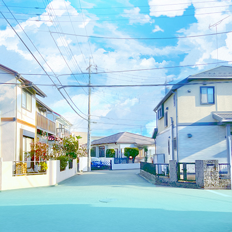
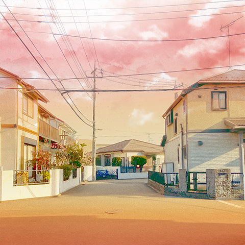
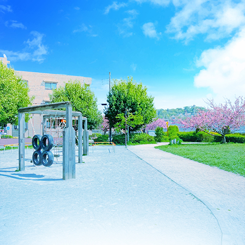
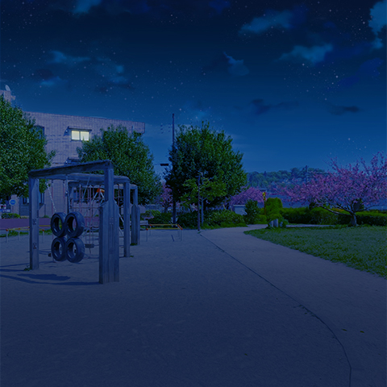
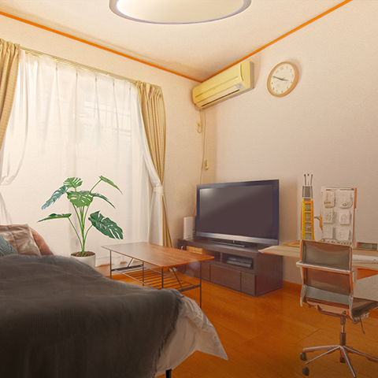
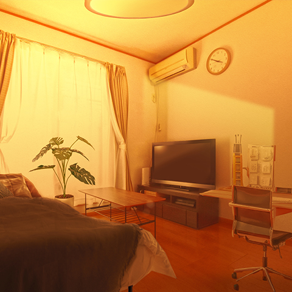
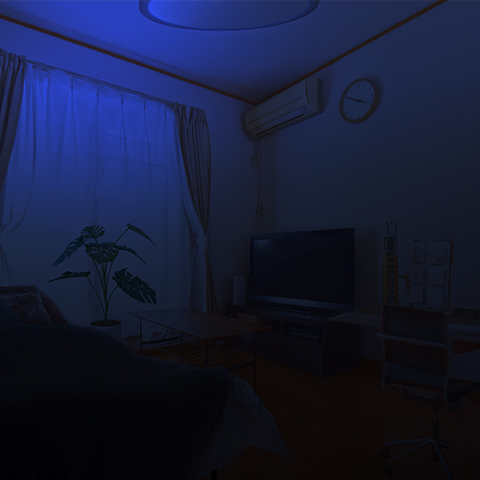

# 背景画像

アドベンチャーゲーム等に利用される背景画像です。

## 構成

[JPEG](./jpg)版と[PNG](./png)版があります。

こちらのカタログには、推奨されるフォーマットの画像のみを掲載しています。

## 学校

### 学校・廊下・昼

### 学校・廊下・夕方

### 学校・廊下・夜

## 住宅街

### 住宅街・昼

### 住宅街・夕方

### 住宅街・夜

## 公園

### 公園・昼

### 公園・夕方

### 公園・夜

## 部屋

### 部屋・昼

### 部屋・夕方

### 部屋・夜

## RPG の戦闘シーン背景

RPG の戦闘シーンなどでの利用を想定しています

## 構成

[PNG](./png)版があります。

### 戦闘背景（渓谷）

.png>)

### 戦闘背景（森）

.png>)

### 戦闘背景（草原）

.png>)
