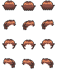
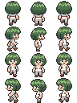

# キャラクター画像

RPG等に利用される、ドット絵のキャラクター画像です。

[akashic-simple-character4](https://github.com/shinonomekazan/akashic-simple-character4)等のライブラリを使うと、効率よくゲームに導入することができます。

## プレイヤーキャラクター

### 兵士

### 魔女

### 村人

### 犬

### スライム

## 合成素材

いわゆるキャラクター合成器に入れるための素材です。

[合成器フォルダ](./合成器/)の中に、node.jsで生成するサンプルスクリプトも格納されています。

### 素体

### 髪型1

### 髪型2

### 髪型3

### サンプル

