# キャラクター画像

RPG等に利用される、ドット絵のキャラクター画像です。

[akashic-simple-character4](https://github.com/shinonomekazan/akashic-simple-character4)等のライブラリを使うと、効率よくゲームに導入することができます。

## プレイヤーキャラクター

### 兵士

### 魔女

### 村人

### 犬

### スライム

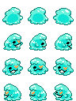

### ゴブリン

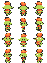
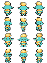

### ツノウサギ

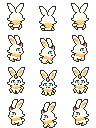

## 合成素材

いわゆるキャラクター合成器に入れるための素材です。

[合成器フォルダ](./合成器/)の中に、node.jsで生成するサンプルスクリプトも格納されています。

### 服・顔あり素体

服と顔がついている素体です。

こちらの素体を利用する場合、顔パーツはつけず、服も全身を覆うタイプのみになります。

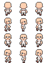

### 服・顔無し素体

新しい服と顔無しの素体です。顔パーツや、幅広い服に対応する事ができます。

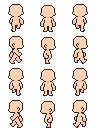
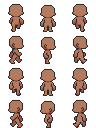
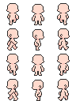
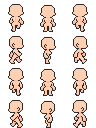
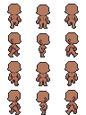
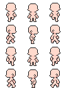

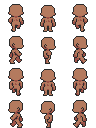
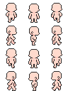

### 顔

量が多く、合成しないとわかりづらいですが、詳細は[顔フォルダ](./合成器/顔/)をご参照ください。以下のような素材です。

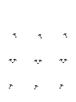
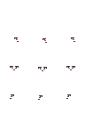
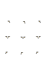

### 髪型

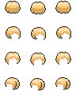

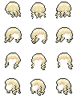
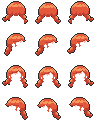

### 服

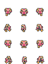
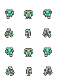
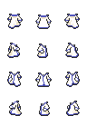
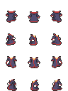

### 帽子

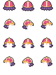
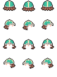
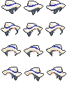
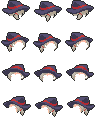

### サンプル

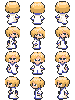
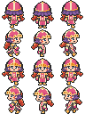
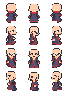
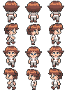
