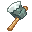
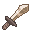
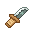
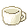
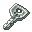
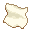
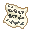
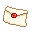
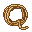
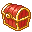

# アイテム画像

脱出ゲーム等に利用できるアイテム画像です。

## 構成

[PNG](./png)版があります。

## 武器

### 斧

### 剣

### ナイフ

## コップなど

### コップ

### ワイングラス

### マグカップ

## 鍵

### 鍵（ファンタジー）
.png)

### 鍵（現代）

## 紙

### 紙（無地）

### 紙（文字あり）

### 手紙

## その他

### ハサミ

### ライター

### ロープ

### 宝箱

